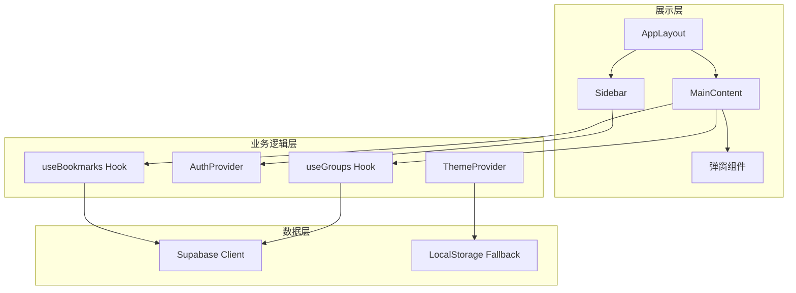

## 产品概述

Mini_Tab 是一款专业的网站书签管理工具，帮助用户高效组织和管理网络收藏。支持新建分组、添加书签、自动获取网站 Logo 和简介，以及从浏览器导出的书签文件批量导入。

## 核心功能

1. **侧栏导航系统**：包含"发现"、"智能工具"、"我的书签"三个主导航项，支持展开/折叠状态切换，书签分组快速定位
2. **书签分组管理**：新建/编辑/删除分组，分组内书签的 4 列网格展示
3. **书签 CRUD**：添加/编辑/删除书签，自动获取网站 favicon 和描述信息
4. **浏览器书签导入**：解析 Netscape Bookmark File 格式（HTML），批量导入分组和书签
5. **全局搜索**：支持按书签名称、URL、描述搜索，展示有结果/无结果两种状态
6. **轮播卡片**：主内容区顶部 3 张推荐卡片展示
7. **占位页面**："发现"和"智能工具"显示"开发中"提示
8. **浮动功能按钮**：右下角主题切换（亮/暗模式）和回到顶部功能

## Tech Stack

- **前端框架**: React 18 + TypeScript 5
- **构建工具**: Vite 5
- **UI 组件库**: shadcn/ui (基于 Radix UI)
- **样式方案**: TailwindCSS 3.4 + CSS Variables
- **图标库**: lucide-react
- **后端服务**: Supabase (PostgreSQL + Auth + Storage)
- **路由**: React Router v6
- **状态管理**: React Context + Custom Hooks
- **工具库**: clsx, tailwind-merge

## 实现方案

### 整体架构策略

采用分层架构设计，将应用分为展示层（UI 组件）、业务逻辑层（Hooks + Context）、数据访问层（Supabase Client）。通过 React Context 管理全局状态（主题、认证、侧栏折叠状态），使用自定义 Hooks 封装书签和分组的 CRUD 操作，确保逻辑复用和关注点分离。

### 核心技术决策

1. **Design Token 系统**：基于 Figma 设计稿提取的色彩体系，使用 CSS Variables 定义，支持主题切换

- 主背景: `--background: #FCFBF8`
- 卡片 hover: `--card-hover: #F7F4ED`
- 边框: `--border: #ECEAE4`, `--border-strong: #D8D6CF`
- 文字主色: `--foreground: #1C1C1C`
- 文字次要: `--muted-foreground: #5F5F5D`

2. **组件交互状态**：严格按照 47_507 设计稿实现

- 分组头部：默认态 -> hover 显示 4 操作图标 -> hover 单个图标背景加深
- 书签卡片：默认态 -> hover 显示编辑/删除图标并变更背景色
- Input/Button：多状态支持（default/hover/focus/disabled）

3. **数据持久化**：使用 Supabase 实现

- 匿名用户本地存储作为 fallback
- 登录用户数据同步到云端

4. **书签导入**：解析标准 Netscape Bookmark File Format

- 使用 DOMParser 解析 HTML
- 提取 `<DT><A>` 标签中的 title、href、icon
- 根据 `<DL>` 嵌套结构识别分组层级

### 性能与可靠性

- **虚拟滚动**：书签列表超过 100 条时启用虚拟滚动
- **防抖搜索**：搜索输入 300ms 防抖
- **图片懒加载**：favicon 图片懒加载
- **错误边界**：关键组件使用 ErrorBoundary 包裹

## 实现注意事项

1. **Supabase 集成**

- URL: `https://jjuwtodnalznyfblpzqy.supabase.co`
- 使用环境变量存储 ANON_KEY
- 客户端单例模式初始化

2. **favicon 获取策略**

- 优先使用 Google Favicon API: `https://www.google.com/s2/favicons?domain={domain}&sz=64`
- 备选 DuckDuckGo: `https://icons.duckduckgo.com/ip3/{domain}.ico`
- 失败时显示默认图标

3. **响应式布局**

- 基准宽度 1440px，侧栏 220px
- 书签卡片 4 列网格，列宽 260px，间距 24px
- 侧栏折叠时内容区自适应扩展

## 架构设计



## 目录结构

```
/Users/iacc/minitab_v2/
├── index.html                    # [NEW] HTML 入口文件
├── package.json                  # [NEW] 项目配置，定义依赖和脚本
├── tsconfig.json                 # [NEW] TypeScript 配置，含路径别名
├── tsconfig.node.json            # [NEW] Node 环境 TypeScript 配置
├── vite.config.ts                # [NEW] Vite 构建配置，含别名和插件
├── tailwind.config.js            # [NEW] TailwindCSS 配置，含 Design Token
├── postcss.config.js             # [NEW] PostCSS 配置
├── components.json               # [NEW] shadcn/ui 组件配置
├── .env.local                    # [NEW] 环境变量（Supabase 凭证）
├── src/
│   ├── main.tsx                  # [NEW] React 应用入口，挂载根组件
│   ├── App.tsx                   # [NEW] 应用根组件，路由配置
│   ├── index.css                 # [NEW] 全局样式，CSS Variables，Design Token
│   ├── lib/
│   │   ├── utils.ts              # [NEW] 工具函数（cn 类名合并等）
│   │   └── supabase.ts           # [NEW] Supabase 客户端初始化和配置
│   ├── types/
│   │   └── index.ts              # [NEW] TypeScript 类型定义（Bookmark, Group, User）
│   ├── hooks/
│   │   ├── useBookmarks.ts       # [NEW] 书签 CRUD 操作 Hook
│   │   ├── useGroups.ts          # [NEW] 分组 CRUD 操作 Hook
│   │   ├── useSearch.ts          # [NEW] 搜索功能 Hook（防抖处理）
│   │   └── useBookmarkImport.ts  # [NEW] 浏览器书签文件解析导入 Hook
│   ├── contexts/
│   │   ├── ThemeContext.tsx      # [NEW] 主题上下文（亮/暗模式切换）
│   │   └── AuthContext.tsx       # [NEW] 认证上下文（登录状态、用户信息）
│   ├── components/
│   │   ├── ui/                   # [NEW] shadcn/ui 基础组件目录
│   │   │   ├── button.tsx        # [NEW] 按钮组件（含多种状态变体）
│   │   │   ├── input.tsx         # [NEW] 输入框组件（含多种状态变体）
│   │   │   ├── dialog.tsx        # [NEW] 对话框组件
│   │   │   ├── dropdown-menu.tsx # [NEW] 下拉菜单组件
│   │   │   ├── scroll-area.tsx   # [NEW] 滚动区域组件
│   │   │   └── tooltip.tsx       # [NEW] 工具提示组件
│   │   ├── layout/
│   │   │   ├── AppLayout.tsx     # [NEW] 应用布局容器（侧栏+主内容区）
│   │   │   ├── Sidebar.tsx       # [NEW] 侧栏组件（导航、分组列表、用户菜单）
│   │   │   └── MainContent.tsx   # [NEW] 主内容区容器
│   │   ├── bookmarks/
│   │   │   ├── BookmarkCard.tsx  # [NEW] 书签卡片组件（含 hover 操作图标）
│   │   │   ├── BookmarkGroup.tsx # [NEW] 书签分组组件（标题+操作图标+书签网格）
│   │   │   ├── BookmarkList.tsx  # [NEW] 书签列表组件（多分组展示）
│   │   │   └── AddBookmarkCard.tsx # [NEW] 添加书签占位卡片
│   │   ├── dialogs/
│   │   │   ├── CreateGroupDialog.tsx    # [NEW] 新建分组弹窗
│   │   │   ├── EditGroupDialog.tsx      # [NEW] 编辑分组弹窗
│   │   │   ├── AddBookmarkDialog.tsx    # [NEW] 添加书签弹窗
│   │   │   ├── EditBookmarkDialog.tsx   # [NEW] 编辑书签弹窗
│   │   │   ├── ImportBookmarkDialog.tsx # [NEW] 导入书签弹窗（文件上传）
│   │   │   └── DeleteConfirmDialog.tsx  # [NEW] 删除确认弹窗
│   │   ├── search/
│   │   │   ├── SearchBar.tsx     # [NEW] 搜索栏组件
│   │   │   └── SearchResults.tsx # [NEW] 搜索结果弹窗（有结果/无结果态）
│   │   ├── carousel/
│   │   │   └── CarouselBanner.tsx # [NEW] 轮播卡片组件（3 张推荐卡片）
│   │   └── common/
│   │       ├── FloatingActions.tsx # [NEW] 浮动操作按钮（主题切换、回到顶部）
│   │       ├── UserMenu.tsx       # [NEW] 用户菜单（个人中心、退出）
│   │       └── GroupMenu.tsx      # [NEW] 分组操作菜单（新建分组、导入书签）
│   └── pages/
│       ├── BookmarksPage.tsx     # [NEW] 我的书签页面（核心功能）
│       ├── ExplorePage.tsx       # [NEW] 发现页面（占位，显示"开发中"）
│       └── ToolsPage.tsx         # [NEW] 智能工具页面（占位，显示"开发中"）
└── assets/                       # [EXISTING] Figma 导出资源（仅保留轮播图片）
```

## 关键代码结构

### 类型定义

```typescript
// src/types/index.ts
export interface BookmarkGroup {
  id: string;
  name: string;
  sort_order: number;
  created_at: string;
  updated_at: string;
}

export interface Bookmark {
  id: string;
  group_id: string;
  title: string;
  url: string;
  description?: string;
  favicon_url?: string;
  sort_order: number;
  created_at: string;
  updated_at: string;
}

export interface User {
  id: string;
  email?: string;
  name?: string;
  avatar_url?: string;
}
```

### Supabase 数据库 Schema

```sql
-- bookmark_groups 表
CREATE TABLE bookmark_groups (
  id UUID PRIMARY KEY DEFAULT gen_random_uuid(),
  user_id UUID REFERENCES auth.users(id),
  name VARCHAR(100) NOT NULL,
  sort_order INTEGER DEFAULT 0,
  created_at TIMESTAMPTZ DEFAULT NOW(),
  updated_at TIMESTAMPTZ DEFAULT NOW()
);

-- bookmarks 表
CREATE TABLE bookmarks (
  id UUID PRIMARY KEY DEFAULT gen_random_uuid(),
  group_id UUID REFERENCES bookmark_groups(id) ON DELETE CASCADE,
  title VARCHAR(200) NOT NULL,
  url TEXT NOT NULL,
  description TEXT,
  favicon_url TEXT,
  sort_order INTEGER DEFAULT 0,
  created_at TIMESTAMPTZ DEFAULT NOW(),
  updated_at TIMESTAMPTZ DEFAULT NOW()
);

-- 启用 RLS
ALTER TABLE bookmark_groups ENABLE ROW LEVEL SECURITY;
ALTER TABLE bookmarks ENABLE ROW LEVEL SECURITY;
```

## 设计风格

采用现代极简主义设计风格，以温暖的米白色为主基调，营造专注、舒适的阅读体验。界面布局遵循 1440x1000px 设计基准，左侧固定 220px 侧栏导航，右侧为主内容区域。

## 页面设计

### 主布局

- **侧栏（220px）**：顶部 Mini_Tab 品牌标识（Georgia 字体），主导航项（发现/智能工具/我的书签），书签分组快捷入口，底部用户信息和设置入口
- **主内容区**：顶部居中搜索栏（540px 宽），下方 3 张轮播推荐卡片（360x160px），再下方为书签分组列表，每组包含标题行和 4 列书签网格

### 侧栏交互规范

- 导航项 hover 时背景变为 #D8D6CF
- "我的书签"右侧有"+"号按钮，点击弹出菜单（新建分组/导入书签）
- 当前选中的分组背景色为 #ECEAE4
- 底部用户区域点击更多图标弹出菜单（个人中心/退出）
- 支持折叠/展开切换

### 书签卡片交互

- 默认态：背景 #FCFBF8，显示 favicon（40x40px 圆角 12px）、标题（14px 500）、描述/URL（12px 400 灰色）
- Hover 态：背景变为 #F7F4ED，边框 #ECEAE4，右侧显示编辑/删除图标（24x24px）
- 图标 Hover：图标背景变为 #D8D6CF

### 分组标题行交互

- 默认态：仅显示分组名称（20px 600）
- Hover 态：右侧显示 4 个操作图标（添加书签/编辑分组/导出/删除），圆形背景 #F7F4ED
- 图标 Hover：背景变为 #D8D6CF

### 弹窗设计

- 弹窗宽度 360-384px，圆角 12px，背景 #FCFBF8
- 遮罩层 rgba(0,0,0,0.70)
- 标题 24px 600，关闭按钮右上角
- 输入框 40px 高，圆角 12px，边框 #D8D6CF
- 按钮组：取消按钮背景 #ECEAE4，确认按钮背景 #1C1C1C

### 搜索功能

- 搜索栏居中，540px 宽，40px 高，圆角 12px
- 有结果时弹出 720x420px 结果面板，列表式展示匹配书签
- 无结果时显示"搜索结果为空"居中提示

### 浮动按钮

- 位于页面右下角，固定定位
- 两个圆形按钮：主题切换、回到顶部
- 按钮尺寸 40x40px，背景 #F7F4ED，hover 时 #D8D6CF