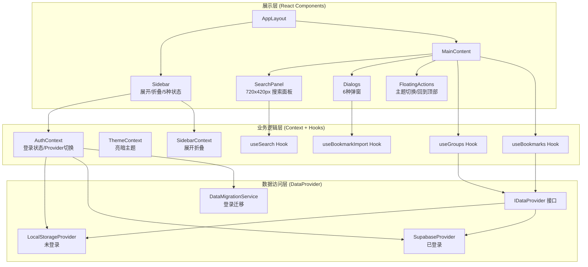

## 产品概述

Mini_Tab 是一款专业的网站书签管理 Web 应用，帮助用户高效组织和管理网络收藏。支持新建分组、添加书签、自动获取网站 Logo 和简介，以及从浏览器导出的书签文件批量导入。应用严格区分登录前后的数据隔离策略，未登录用户使用本地存储浏览预置内容，已登录用户享受完整的云端 CRUD 功能。

## 核心功能

1. **侧栏导航系统**：包含"发现"、"智能工具"、"我的书签"三个主导航项，支持展开/折叠切换，书签分组快捷定位，5种状态切换（未登录/Hover菜单项/已自定义分组/点击更多/点击加号）
2. **账号登录与数据隔离**：未登录用户数据存储在 localStorage 仅可浏览，已登录用户数据同步至 Supabase 云端享受完整 CRUD；首次登录时支持本地数据迁移至云端
3. **书签分组管理**：新建/编辑/删除分组（仅登录后），分组内书签 4 列网格展示，分组头部 hover 显示 4 个操作图标（添加/编辑/导出/删除）
4. **书签 CRUD**：添加/编辑/删除书签（仅登录后），自动通过 URL 获取网站 favicon，书签卡片 hover 显示编辑/删除图标
5. **浏览器书签导入**：解析 Netscape Bookmark File 格式（HTML），批量导入分组和书签
6. **全局搜索**：搜索栏居中 540px 宽，支持按名称/URL/描述搜索，弹出 720x420px 搜索结果面板，展示有结果/无结果两种状态
7. **轮播卡片**：主内容区顶部 3 张推荐卡片，360x160px，圆角 12px
8. **占位页面**："发现"和"智能工具"页面显示"开发中"提示
9. **浮动功能按钮**：页面右下角固定定位，主题切换（亮/暗模式）和回到顶部
10. **弹窗系统**：新建分组（360x216px）、编辑组名、添加书签（384x412px）、编辑书签、导入书签、删除确认，遮罩层 rgba(0,0,0,0.70)

## Tech Stack

- **前端框架**: React 18 + TypeScript 5
- **构建工具**: Vite 5
- **UI 组件库**: shadcn/ui v1（基于 Radix UI，CLI: `npx shadcn@latest add`）
- **样式方案**: TailwindCSS 3.4.17 + CSS Variables（Design Token）
- **图标库**: lucide-react
- **后端服务**: Supabase（PostgreSQL + Auth + RLS）
- **路由**: React Router v6
- **状态管理**: React Context + Custom Hooks
- **工具库**: clsx, tailwind-merge, tailwindcss-animate

## 实现方案

### 整体架构策略

采用三层分离架构：展示层（React 组件）、业务逻辑层（Context + Hooks）、数据访问层（DataProvider 抽象）。核心设计决策是通过 **DataProvider 接口抽象** 实现登录前后的无缝切换 —— `IDataProvider` 接口定义统一的 CRUD 方法签名，`LocalStorageProvider` 和 `SupabaseProvider` 分别实现本地和云端存储，`AuthContext` 根据登录状态自动注入对应 Provider。这样业务组件无需感知底层存储差异，只需调用 Hook 即可。

### 核心技术决策

**1. Design Token 系统（CSS Variables + TailwindCSS 扩展）**

基于 Figma 设计稿提取的精确色彩体系，通过 CSS Variables 定义亮/暗双主题，并在 `tailwind.config.js` 中映射为语义化 Tailwind 类名：

| Token | 亮色模式 | 暗色模式 | Tailwind 类 |
| --- | --- | --- | --- |
| 主背景 | #FCFBF8 | #1A1A1A | `bg-background` |
| 卡片hover | #F7F4ED | #2A2A2A | `bg-card-hover` |
| 边框 | #ECEAE4 | #333333 | `border-border` |
| 边框强调 | #D8D6CF | #444444 | `border-border-strong` |
| 文字主色 | #1C1C1C | #E5E5E5 | `text-foreground` |
| 文字次要 | #5F5F5D | #999999 | `text-muted-foreground` |
| 占位符 | #D8D6CF | #555555 | `text-placeholder` |
| 按钮主色 | #1C1C1C | #E5E5E5 | `bg-primary` |
| 取消按钮 | #ECEAE4 | #333333 | `bg-secondary` |


**2. 数据隔离架构（IDataProvider 策略模式）**

- **未登录用户**：`LocalStorageProvider` 读写 `minitab_local_groups` / `minitab_local_bookmarks`；预置"热门网站"分组及常用书签；UI 层隐藏所有 CRUD 操作入口（分组头部操作图标、书签卡片编辑/删除图标、加号菜单均不渲染）；侧栏底部显示"登录"按钮（196x32px，#1C1C1C 背景，白色文字，圆角 16px）
- **已登录用户**：`SupabaseProvider` 读写 `bookmark_groups` / `bookmarks` 表；RLS 策略确保 `auth.uid() = user_id`；完整 CRUD 交互；侧栏底部显示用户信息（头像+名称+更多按钮）
- **登录迁移**：首次登录检测 localStorage 数据，若有则弹窗询问是否迁移，确认后批量 insert 到 Supabase 并清除本地数据
- **退出登录**：清除 Supabase session，切回 LocalStorageProvider，重新加载本地预置数据

**3. 组件交互状态（严格匹配 47_507 设计稿）**

- **分组头部**：默认仅显示分组名称（20px 600 #1C1C1C）→ hover 分组行时右侧浮现 4 个操作图标（32x32px 圆形，背景 #F7F4ED，圆角 16px，间距 40px）→ hover 单个图标时该图标背景变为 #D8D6CF。**仅登录后显示**。
- **书签卡片**：默认态 260x50px 背景 #FCFBF8 → hover 态背景 #F7F4ED + 边框 1px #ECEAE4 + 右侧浮现编辑/删除图标（24x24px，圆角 16px）→ hover 编辑图标时背景 #D8D6CF。**编辑/删除图标仅登录后显示**。
- **Input 5态**：默认（border #D8D6CF）、hover（border #5F5F5D）、已填写（text #1C1C1C, border #D8D6CF）、disabled（bg #F7F4ED, text #D8D6CF）、readonly（bg #F7F4ED, text #1C1C1C）
- **Button**：取消按钮（默认 #ECEAE4 → hover #D8D6CF → disabled 文字#D8D6CF）、确认按钮（默认 #1C1C1C → hover black → disabled opacity 0.50）

**4. 搜索功能**

点击搜索栏后弹出全屏遮罩 rgba(0,0,0,0.70)，居中显示 720x420px 搜索面板。顶部 65px 高搜索输入区（底边框 1px #D8D6CF），下方显示搜索结果列表或"搜索结果为空"居中提示。300ms 防抖，搜索 title/url/description 三个字段。

**5. 书签导入**

使用 DOMParser 解析标准 Netscape Bookmark File Format HTML。提取 `<DT><A>` 标签的 href、title、ICON（base64 data URI）属性，根据 `<DL>` 嵌套识别分组层级。导入时批量创建分组和书签。

**6. Favicon 获取策略**

优先 Google Favicon API：`https://www.google.com/s2/favicons?domain={domain}&sz=64`，备选 DuckDuckGo：`https://icons.duckduckgo.com/ip3/{domain}.ico`，均失败时显示默认图标占位。

### 性能与可靠性

- **搜索防抖**：300ms debounce 避免频繁查询
- **Favicon 懒加载**：`loading="lazy"` 属性延迟加载图片
- **Context 分离**：ThemeContext / AuthContext / SidebarContext 独立，避免不必要的重渲染
- **Supabase 客户端单例**：全局只初始化一次，避免重复创建连接

## 实现注意事项

1. **Supabase 集成**：URL `https://jjuwtodnalznyfblpzqy.supabase.co`，ANON_KEY 存入 `.env.local`，使用 `@supabase/supabase-js` createClient 单例模式。认证使用 Email+Password 方式，通过 `onAuthStateChange` 监听登录状态切换 Provider。
2. **shadcn/ui 初始化**：先 `npx shadcn@latest init`，再按需 `npx shadcn@latest add button input dialog dropdown-menu scroll-area tooltip select textarea`。组件安装后在 `src/components/ui/` 目录。
3. **侧栏折叠态**：折叠后侧栏隐藏，主内容区从 left:12px 开始，宽度 1416px（来自 41_438 设计稿），左上角显示展开按钮（32x32px）。
4. **弹窗精确尺寸**：新建/编辑分组 360x216px，添加/编辑书签 384x412px，均需 `overflow: hidden` + `border-radius: 12px`。输入框、按钮的内边距和定位严格遵循 Figma HTML 中的绝对定位数值转换为 Tailwind padding/margin。
5. **加号菜单/更多菜单**：加号菜单 84x78px，更多菜单 196x78px，均使用 `box-shadow: 0px 4px 12px rgba(0,0,0,0.06), 0px 1px 8px rgba(0,0,0,0.04)`，圆角 6px，边框 1px #ECEAE4。菜单项 hover 背景 #ECEAE4，圆角 4px。
6. **字体**：Logo 使用 Georgia 24px 700，正文使用 PingFang SC（系统字体），菜单项使用 Inter 14px 400。

## 架构设计



## 目录结构

```
/Users/iacc/minitab_v2/
├── index.html                        # [NEW] HTML 入口，charset utf-8，加载 main.tsx
├── package.json                      # [NEW] 项目依赖配置（react, vite, tailwindcss, shadcn 相关, supabase, react-router-dom, lucide-react）
├── tsconfig.json                     # [NEW] TypeScript 配置，paths 别名 "@/*" -> "./src/*"
├── tsconfig.app.json                 # [NEW] App TS 配置，verbatimModuleSyntax:false, noUnusedLocals:false
├── tsconfig.node.json                # [NEW] Node 环境 TS 配置
├── vite.config.ts                    # [NEW] Vite 构建配置，resolve alias @->src，server host 0.0.0.0 + allowedHosts:true
├── tailwind.config.js                # [NEW] TailwindCSS 配置，扩展 Design Token 色彩/圆角/阴影/字体到语义化类名，支持 dark 模式
├── postcss.config.js                 # [NEW] PostCSS 配置（tailwindcss + autoprefixer）
├── components.json                   # [NEW] shadcn/ui CLI 配置（aliases, style, tailwind）
├── .env.local                        # [NEW] 环境变量：VITE_SUPABASE_URL, VITE_SUPABASE_ANON_KEY
├── src/
│   ├── main.tsx                      # [NEW] React 入口，挂载 App 到 #root，包裹全局 Provider（Theme/Auth/Sidebar）
│   ├── App.tsx                       # [NEW] 根组件，React Router 路由配置（/explore, /tools, /bookmarks），默认重定向到 /bookmarks
│   ├── index.css                     # [NEW] 全局样式，@tailwind 指令，CSS Variables 定义（:root 亮色 / .dark 暗色），Design Token 完整色彩/间距/阴影
│   ├── lib/
│   │   ├── utils.ts                  # [NEW] cn() 类名合并工具（clsx + tailwind-merge）
│   │   └── supabase.ts              # [NEW] Supabase 客户端单例初始化（createClient），环境变量读取
│   ├── types/
│   │   └── index.ts                  # [NEW] 全局类型定义：BookmarkGroup, Bookmark, User, IDataProvider 接口, NavItem, DialogType 枚举
│   ├── providers/
│   │   ├── LocalStorageProvider.ts   # [NEW] 本地存储实现 IDataProvider，读写 localStorage，预置"热门网站"分组和常用书签数据
│   │   ├── SupabaseProvider.ts       # [NEW] 云端存储实现 IDataProvider，封装 Supabase CRUD（含 user_id 过滤），返回类型与本地一致
│   │   └── DataMigrationService.ts   # [NEW] 登录迁移服务，检测本地数据 → 批量 insert 到 Supabase → 清除 localStorage
│   ├── hooks/
│   │   ├── useBookmarks.ts           # [NEW] 书签 CRUD Hook，从 AuthContext 获取当前 DataProvider，暴露 bookmarks/addBookmark/updateBookmark/deleteBookmark/fetchFavicon
│   │   ├── useGroups.ts              # [NEW] 分组 CRUD Hook，暴露 groups/addGroup/updateGroup/deleteGroup/exportGroup
│   │   ├── useSearch.ts              # [NEW] 搜索 Hook，300ms 防抖，搜索 title/url/description，返回 results/isSearching/isEmpty 状态
│   │   └── useBookmarkImport.ts      # [NEW] 书签导入 Hook，DOMParser 解析 Netscape HTML，提取分组层级和书签数据，批量创建
│   ├── contexts/
│   │   ├── ThemeContext.tsx           # [NEW] 主题 Context，管理 light/dark 模式，切换时 toggle document.documentElement 的 class，localStorage 持久化主题偏好
│   │   ├── AuthContext.tsx            # [NEW] 认证 Context，Supabase onAuthStateChange 监听，管理 user/session/isAuthenticated，根据登录状态切换 DataProvider 实例，提供 signIn/signUp/signOut 方法
│   │   └── SidebarContext.tsx         # [NEW] 侧栏 Context，管理 isCollapsed/activeNav/activeGroup 状态
│   ├── components/
│   │   ├── ui/                       # [NEW] shadcn/ui 基础组件目录（通过 CLI 安装）
│   │   │   ├── button.tsx            # [NEW] shadcn Button，自定义 variant 匹配设计稿：primary(#1C1C1C)/secondary(#ECEAE4)/ghost
│   │   │   ├── input.tsx             # [NEW] shadcn Input，自定义样式匹配 5 种状态
│   │   │   ├── dialog.tsx            # [NEW] shadcn Dialog，遮罩色 rgba(0,0,0,0.70)
│   │   │   ├── dropdown-menu.tsx     # [NEW] shadcn DropdownMenu
│   │   │   ├── scroll-area.tsx       # [NEW] shadcn ScrollArea
│   │   │   ├── select.tsx            # [NEW] shadcn Select（分组选择下拉）
│   │   │   ├── textarea.tsx          # [NEW] shadcn Textarea（简介输入）
│   │   │   └── tooltip.tsx           # [NEW] shadcn Tooltip
│   │   ├── layout/
│   │   │   ├── AppLayout.tsx         # [NEW] 应用布局容器，flex 布局，侧栏 220px（展开）/ 0px（折叠），主内容区自适应。折叠态主内容区 left:12px 宽 1416px
│   │   │   ├── Sidebar.tsx           # [NEW] 侧栏组件：Logo区(Mini_Tab Georgia 24px 700 + 收起按钮)、导航区(发现/智能工具/我的书签 + 加号按钮)、分组列表区(子分组缩进 left:26px, 170x36px)、底部区(未登录:登录按钮 / 已登录:用户头像+名称+更多按钮)。5种状态全覆盖
│   │   │   └── MainContent.tsx       # [NEW] 主内容区容器，背景 #FCFBF8，圆角 12px，边框 1px #ECEAE4，内边距 top:12px
│   │   ├── bookmarks/
│   │   │   ├── BookmarkCard.tsx      # [NEW] 书签卡片 260x50px，favicon(40x40 圆角12px) + 文字区(标题14px 500 + 描述12px 400)，hover 态交互（仅登录后显示编辑/删除图标 24x24px），点击跳转 URL
│   │   │   ├── BookmarkGroup.tsx     # [NEW] 书签分组，标题行(20px 600) + 操作图标区(4个32x32 圆形按钮，hover显示/隐藏) + 4列书签网格(gap 24px)，末尾添加书签占位卡片
│   │   │   ├── BookmarkList.tsx      # [NEW] 书签列表，纵向排列所有分组，分组间距 24px
│   │   │   └── AddBookmarkCard.tsx   # [NEW] 添加书签占位卡片 260x50px，灰色图标区(40x40 bg #F7F4ED) + "添加书签"文字(14px #5F5F5D)，点击打开添加弹窗
│   │   ├── dialogs/
│   │   │   ├── CreateGroupDialog.tsx # [NEW] 新建分组弹窗 360x216px，标题"新建分组"24px 600，输入框 296x40px，取消/保存按钮各 143x40px，空态保存按钮 rgba(28,28,28,0.50)
│   │   │   ├── EditGroupDialog.tsx   # [NEW] 编辑组名弹窗 360x216px，预填分组名，边框 hover 态 #5F5F5D
│   │   │   ├── AddBookmarkDialog.tsx # [NEW] 添加书签弹窗 384x412px，4字段(名称/URL/分组选择/简介textarea 68px高)，输入框 320x40px，取消/保存按钮各 155x40px
│   │   │   ├── EditBookmarkDialog.tsx # [NEW] 编辑书签弹窗 384x412px，预填数据，分组选择带下拉箭头
│   │   │   ├── ImportBookmarkDialog.tsx # [NEW] 导入书签弹窗，文件上传区（接受 .html 文件），解析预览，确认导入
│   │   │   └── DeleteConfirmDialog.tsx # [NEW] 删除确认弹窗，"确定删除?"提示，取消/确认按钮
│   │   ├── search/
│   │   │   └── SearchPanel.tsx       # [NEW] 搜索面板 720x420px，顶部 65px 搜索输入区(图标 left:32px + 输入框 20px #5F5F5D) + 底部结果区(书签列表卡片 带阴影 box-shadow / 或"搜索结果为空"居中提示)，全屏遮罩触发
│   │   ├── carousel/
│   │   │   └── CarouselBanner.tsx    # [NEW] 轮播组件，3张卡片 360x160px，间距 16px，圆角 12px，背景 #1C1C1C，使用 assets 中的 png 图片
│   │   ├── auth/
│   │   │   └── LoginDialog.tsx       # [NEW] 登录/注册弹窗，Email+Password 表单，调用 Supabase Auth signInWithPassword / signUp
│   │   └── common/
│   │       ├── FloatingActions.tsx    # [NEW] 浮动按钮组，固定右下角，两个 40x40px 圆形按钮（Sun/Moon 主题切换 + ArrowUp 回到顶部），背景 #F7F4ED hover #D8D6CF
│   │       ├── UserMenu.tsx          # [NEW] 用户更多菜单 196x78px，选项：个人中心(hover #ECEAE4) / 退出，阴影 box-shadow
│   │       └── GroupMenu.tsx         # [NEW] 加号菜单 84x78px，选项：新建分组(hover #ECEAE4) / 导入书签
│   └── pages/
│       ├── BookmarksPage.tsx         # [NEW] 我的书签页面（核心），组合 SearchPanel + CarouselBanner + BookmarkList，管理弹窗状态
│       ├── ExplorePage.tsx           # [NEW] 发现页面，居中显示"开发中"占位提示
│       └── ToolsPage.tsx            # [NEW] 智能工具页面，居中显示"开发中"占位提示
└── assets/                           # [EXISTING] Figma 导出资源，轮播用 png 图片保留使用
```

## 关键代码结构

### 数据访问层接口

```typescript
// src/types/index.ts
export interface IDataProvider {
  // 分组
  getGroups(): Promise<BookmarkGroup[]>;
  createGroup(name: string): Promise<BookmarkGroup>;
  updateGroup(id: string, name: string): Promise<BookmarkGroup>;
  deleteGroup(id: string): Promise<void>;
  // 书签
  getBookmarksByGroup(groupId: string): Promise<Bookmark[]>;
  getAllBookmarks(): Promise<Bookmark[]>;
  createBookmark(data: Omit<Bookmark, 'id' | 'created_at' | 'updated_at'>): Promise<Bookmark>;
  updateBookmark(id: string, data: Partial<Bookmark>): Promise<Bookmark>;
  deleteBookmark(id: string): Promise<void>;
  // 搜索
  searchBookmarks(query: string): Promise<Bookmark[]>;
}
```

### Supabase 数据库 Schema

```sql
-- bookmark_groups 表
CREATE TABLE bookmark_groups (
  id UUID PRIMARY KEY DEFAULT gen_random_uuid(),
  user_id UUID NOT NULL REFERENCES auth.users(id) ON DELETE CASCADE,
  name VARCHAR(100) NOT NULL,
  sort_order INTEGER DEFAULT 0,
  created_at TIMESTAMPTZ DEFAULT NOW(),
  updated_at TIMESTAMPTZ DEFAULT NOW()
);

-- bookmarks 表
CREATE TABLE bookmarks (
  id UUID PRIMARY KEY DEFAULT gen_random_uuid(),
  group_id UUID NOT NULL REFERENCES bookmark_groups(id) ON DELETE CASCADE,
  title VARCHAR(200) NOT NULL,
  url TEXT NOT NULL,
  description TEXT,
  favicon_url TEXT,
  sort_order INTEGER DEFAULT 0,
  created_at TIMESTAMPTZ DEFAULT NOW(),
  updated_at TIMESTAMPTZ DEFAULT NOW()
);

-- RLS 策略
ALTER TABLE bookmark_groups ENABLE ROW LEVEL SECURITY;
ALTER TABLE bookmarks ENABLE ROW LEVEL SECURITY;

CREATE POLICY "Users can CRUD own groups" ON bookmark_groups
  FOR ALL USING (auth.uid() = user_id);

CREATE POLICY "Users can CRUD own bookmarks" ON bookmarks
  FOR ALL USING (
    group_id IN (SELECT id FROM bookmark_groups WHERE user_id = auth.uid())
  );
```

## 设计风格

采用温暖极简主义设计风格，以米白色 #FCFBF8 为主基调，营造专注、舒适的浏览体验。整体界面干净克制，通过细微的色阶变化（#FCFBF8 → #F7F4ED → #ECEAE4 → #D8D6CF）传递层次感。交互状态过渡流畅自然，hover 效果通过背景色渐变和图标显隐实现。暗色模式以 #1A1A1A 为基底，保持相同的层次逻辑。

## 页面规划

### 页面一：我的书签（主页面 BookmarksPage）

- **区块1 - 顶部搜索栏**：居中对齐，宽 540px 高 40px，圆角 12px，边框 1px #D8D6CF。左侧搜索图标 16px 内边距，占位文字"搜索"#D8D6CF 16px。点击后弹出全屏搜索面板。
- **区块2 - 轮播推荐区**：距顶部 104px，3张卡片横向排列，每张 360x160px，间距 16px，圆角 12px，深色背景 #1C1C1C，展示推荐网站图片。
- **区块3 - 书签分组列表**：距轮播 48px，每个分组包含标题行（分组名 20px 600 + hover显示操作图标）和 4 列书签网格（卡片 260x50px，列间距 24px，行间距 24px），末尾为"添加书签"占位卡片。
- **区块4 - 浮动操作按钮**：固定右下角，两个 40x40px 圆形按钮纵向排列（主题切换 + 回到顶部），背景 #F7F4ED，hover #D8D6CF。

### 页面二：侧栏导航（Sidebar 组件）

- **区块1 - 品牌标识区**：顶部 left:12px top:16px，"Mini_Tab" Georgia 24px 700 #1C1C1C，右侧收起/展开按钮。
- **区块2 - 主导航区**：top:68px，三个导航项（发现/智能工具/我的书签），每项 196x36px 圆角 8px，图标+文字布局，hover 背景 #D8D6CF，"我的书签"右侧有加号按钮。
- **区块3 - 分组列表区**：子分组缩进 26px，170x36px，选中态背景 #ECEAE4 圆角 8px。
- **区块4 - 底部用户区**：top:956px，未登录显示"登录"按钮（196x32px #1C1C1C 圆角 16px），已登录显示头像+名称+更多按钮。

### 页面三：搜索面板（SearchPanel 浮层）

- **区块1 - 搜索输入区**：面板顶部 65px 高，左侧搜索图标 left:32px，输入框 20px #5F5F5D，底部分割线 1px #D8D6CF。
- **区块2 - 搜索结果列表**：匹配书签卡片，带阴影和边框（box-shadow 0px 4px 12px rgba(0,0,0,0.06)），favicon 40px + 标题 14px 500 + 描述 12px 400，右侧跳转按钮 32x32px #F7F4ED。
- **区块3 - 空结果提示**：面板居中显示"搜索结果为空"文字 14px #5F5F5D。

### 页面四：弹窗系统（Dialogs）

- **区块1 - 分组弹窗（360x216px）**：标题 24px 600 black，关闭按钮右上角 32x32 圆角 16px，输入框 296x40px 圆角 12px，底部取消/保存按钮各 143x40px。
- **区块2 - 书签弹窗（384x412px）**：4个输入字段（名称/URL/分组下拉/简介textarea 68px），输入框 320x40px，底部取消/保存按钮各 155x40px。
- **区块3 - 导入书签弹窗**：文件上传拖拽区，支持 .html 文件，解析预览列表，确认导入。

### 页面五：占位页面（发现/智能工具）

- **区块1 - 居中提示**：页面正中央显示"开发中"文字，20px #5F5F5D，配合一个工具类图标。

## Agent Extensions

### SubAgent

- **code-explorer**
- Purpose: 在实现过程中探索 Figma 设计稿 HTML 文件中的精确 CSS 数值（尺寸、颜色、间距、阴影），确保像素级还原
- Expected outcome: 获取所有组件的精确样式参数，避免实现时凭记忆出错